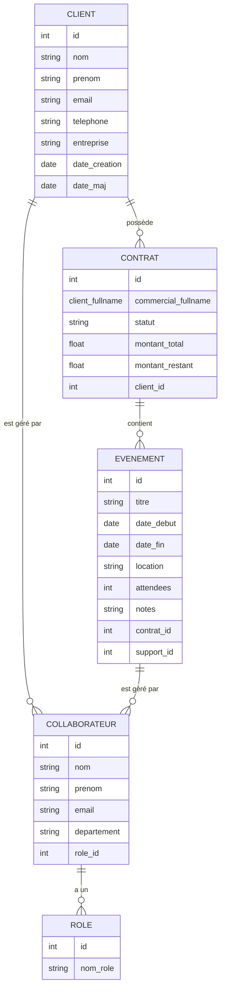

```mermaid
erDiagram
    %% Définition des entités
    CLIENT {
        int id
        string nom
        string prenom
        string email
        string telephone
        string entreprise
        date date_creation
        date date_maj
    }
    CONTRAT {
        int id
        client_fullname
        commercial_fullname
        string statut
        float montant_total
        float montant_restant
        int client_id
    }
    EVENEMENT {
        int id
        string titre
        date date_debut
        date date_fin
        string location
        int attendees
        string notes
        int contrat_id
        int support_id
    }
    COLLABORATEUR {
        int id
        string nom
        string prenom
        string email
        string departement
        int role_id
    }
    ROLE {
        int id
        string nom_role
    }

    %% Relations principales
    CLIENT ||--o{ CONTRAT : "possède"
    CONTRAT ||--o{ EVENEMENT : "contient"
    CLIENT ||--o{ COLLABORATEUR : "est géré par"
    COLLABORATEUR ||--o{ ROLE : "a un"
    EVENEMENT ||--o{ COLLABORATEUR : "est géré par"

```