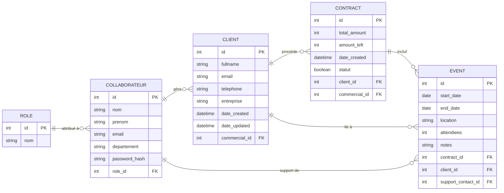

```mermaid
erDiagram
    direction LR

    %% ENTITÉS ================================

    CLIENT {
        int id PK
        string fullname
        string email
        string telephone
        string entreprise
        datetime date_created
        datetime date_updated
        int commercial_id FK
    }

    CONTRACT {
        int id PK
        int total_amount
        int amount_left
        datetime date_created
        boolean statut
        int client_id FK
        int commercial_id FK
    }

    EVENT {
        int id PK
        date start_date
        date end_date
        string location
        int attendiees
        string notes
        int contract_id FK
        int client_id FK
        int support_contact_id FK
    }

    COLLABORATEUR {
        int id PK
        string nom
        string prenom
        string email
        string departement
        string password_hash
        int role_id FK
    }

    ROLE {
        int id PK
        string nom
    }

    %% RELATIONS ================================

    %% Un rôle possède plusieurs collaborateurs
    ROLE ||--o{ COLLABORATEUR : "attribué à"

    %% Un collaborateur gère plusieurs clients (commercial)
    COLLABORATEUR ||--o{ CLIENT : "gère"

    %% Un client possède plusieurs contrats
    CLIENT ||--o{ CONTRACT : "possède"

    %% Un contrat possède plusieurs événements
    CONTRACT ||--o{ EVENT : "inclut"

    %% Un client a plusieurs événements (répété dans modèle : client_id FK dans Event)
    CLIENT ||--o{ EVENT : "lié à"

    %% Un collaborateur support gère plusieurs événements
    COLLABORATEUR ||--o{ EVENT : "support de"


```